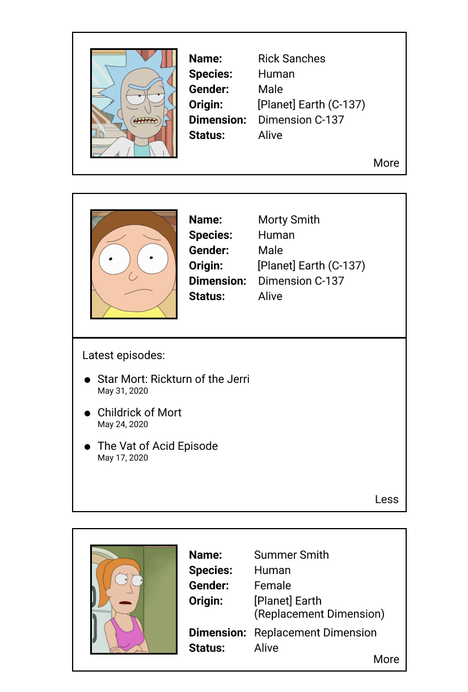

# coding-challenge-frontend-engineer-m

## Specification

Hello!

In order for us to see a bit of how you work and a bit of what you know we came up with this technical challenge. Here you're going to consume from a publicly accessible Graphql API and display some of its information in a web page.

We're are going to be using the [Rick And Morty API](https://rickandmortyapi.com/graphql) for that.
You can find the documentation for the API [here](https://rickandmortyapi.com/documentation).

This repository is a skeleton application you can use as starting point (but if you feel like deleting all the code and starting from scratch nobody is going to stop you). It should work out of the box with only `yarn install` or `yarn start` (or with `npm` if that's your cup of tea).

The requirements for this project are found below. Please read them carefully. We usually try to avoid any tricks or traps in this type of tests so if something is not clear please don't hesitate to contact us.

### 1 - Implement a list of character cards

- There must be a list of character cards consisting of the following character information:
  - image
  - name
  - species
  - gender
  - origin
  - dimension
  - status

- The list must contain all the charaters from the 1st page returned by the api

### 2 - Make the character card expandable with extra information

- There must be a "more" button that, when clicked, expands the card to display a list of the 3 latests episodes that character was displayed in.

- The list of latests episodes must be sorted from the most recent to the oldest episode.

- When the list of latests episodes is open the "more" button becomes a "less" button.

- When the "less" button is clicked the list of latests episodes is collapsed and the "less" button becomes a "more" button.

- Only one card must be expanded. So when a collapsed card is expanded any other expanded card must collapse automatically.

### 3 - Appearance and Code Style

- Your design can be simple but must be consistent and usable (here an [example](#example-of-layout) of what it could look like). So please pay attention to consistency in spacing, readability, usability etc.

- Your code must be clean and easy to understand. So please think of how you name your functions and variables, how you separate concerns within your code, how you organize your modules, how you name your CSS classes, which HTML tags you choose etc.

### Bonus - Pagination

- Not required, but if you have *zeit und lust* you can make your solution paginated and display the rest of the pages from the API
  - You choose how to do it (infitite scroll, pages with a page counter etc).

<h3 id="example-of-layout">Example of layout</h3>

## Requirements

- You must use **React**. This is the main library in our frontend currently.
- You must use **GraphQL**. This is the main form our frontend retrieves data currently.

## How to Deliver

- Fork this repository

- When you're done push your branch into the remote and open a pull request (don't worry, this is a private repo, noone but us is gonna know)

- Please attach to this README.md any considerations you have or any instructions to setup and run your code if it differs from `yarn install` & `yarn start` (or the `npm` equivalent)

- Please feel free to reach out if something is not clear or you have any questions. We will be glad to interact with you and answer any question you may have.

## Tips & Tricks

- If it's taking you more than 3-4 hours to complete this challenge, you're probably overcomplicating something. Keep it simple, clean and smart.

- Feel free to install any libraries you think is necessary, but remember it's not such a complicated project so try to avoid things that could be easily solved with vanilla JS. E.g.: 
  - lodash :thumbsup:
  - [leftpad](https://qz.com/646467/how-one-programmer-broke-the-internet-by-deleting-a-tiny-piece-of-code/) :thumbsdown:

- Commit frequently. If you want you can adopt some commit convention like [conventional commits](https://www.conventionalcommits.org/en/v1.0.0/).

- We'll have time to discuss a bit more about this project in a later moment, so take note of any improvements you'd make if this is a real-life project and, if any, the corners you had to cut.

 
 
 
 

Good Luck!

We're looking forward to see what you can do!

